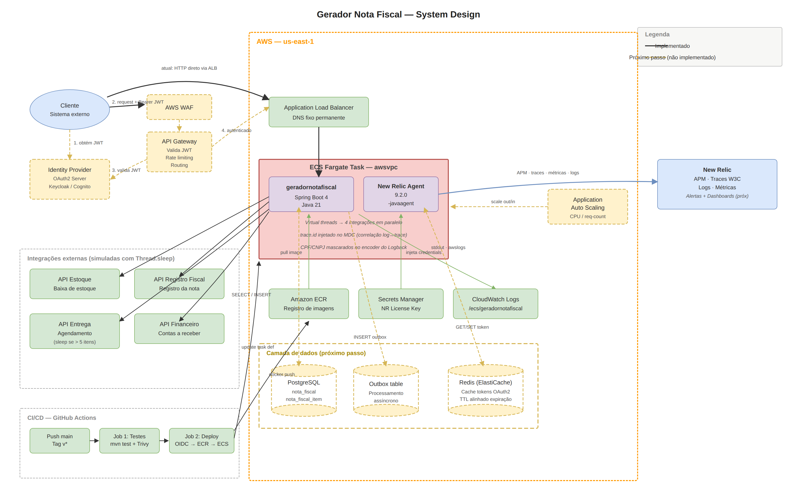

[](https://openjdk.org/projects/jdk/21/)
[](https://spring.io/projects/spring-boot)
[](https://newrelic.com)
[](https://maven.apache.org/)
[](LICENSE)

# Gerador de Nota Fiscal

API REST para geração de notas fiscais a partir de pedidos. O projeto é uma evolução de uma base com bugs críticos de manutenibilidade, qualidade, comportamento funcional e performance. Cada decisão documentada aqui tem uma razão técnica e uma alternativa que foi considerada.

## Sumário

- [Como executar](#como-executar)
- [Stack](#stack)
- [API](#api)
- [Regras de negócio](#regras-de-negócio)
- [Bugs corrigidos](#bugs-corrigidos)
- [Arquitetura](#arquitetura)
- [Pipeline CI/CD](#pipeline-cicd)
- [Estratégia de testes](#estratégia-de-testes)
- [Observabilidade](#observabilidade)
- [Decisões técnicas](#decisões-técnicas)
- [Limitações e próximos passos](#limitações-e-próximos-passos)
- [Contas de acesso](#contas-de-acesso)

## Como executar

Java 21 e Maven 3.9+ são os únicos pré-requisitos. Nenhuma infra externa precisa subir.

```bash
mvn test
mvn spring-boot:run
```

Swagger UI fica em `http://localhost:8080/swagger-ui.html`.

A versão de produção está no ar em `http://geradornotafiscal-alb-1903727799.us-east-1.elb.amazonaws.com`. O Swagger UI fica no mesmo path. Dá para testar direto no ALB sem fazer deploy.

A aplicação tem dois profiles. O `dev` é o padrão local, com logs legíveis no console. O `prod` é o que roda no ECS via `SPRING_PROFILES_ACTIVE=prod`, com logs em JSON estruturado contendo `trace.id` injetado pelo New Relic agent e mascaramento de PII. Para reproduzir o comportamento de produção localmente:

```bash
mvn spring-boot:run -Dspring-boot.run.profiles=prod
```

## Stack

A escolha de tecnologias seguiu o que o desafio pediu (Java 21 e Spring moderno) e o que faz sentido para o caso de uso. Spring Boot 4.0.6 como framework principal. MapStruct 1.6.3 para mapeamento entre camadas em tempo de compilação, gerando código verificado pelo compilador. Logback com Logstash Encoder 8.0 para logs JSON estruturados. springdoc-openapi 3.0.2 para servir o Swagger UI a partir do contrato OpenAPI 3.1. New Relic Java Agent 9.2.0 para APM, distributed tracing W3C e correlação de logs com traces, complementado pelo `micrometer-registry-new-relic` 0.10.0 para as métricas customizadas.

Em infraestrutura: ECS Fargate como runtime de produção, ALB com DNS fixo, ECR para imagens Docker, Secrets Manager para a license key do New Relic injetada no container em runtime, e GitHub Actions com OIDC para CI/CD sem access key de longa duração.

## API

| Endpoint | Método | Descrição |
|---|---|---|
| `/v1/notas-fiscais` | POST | Gera uma nota fiscal a partir do pedido |
| `/swagger-ui.html` | GET | Documentação interativa |
| `/v1/api-docs` | GET | Contrato OpenAPI 3.1 |
| `/actuator/health` | GET | Health check |

### Request

```json
{
  "id_pedido": 1,
  "data": "2026-05-15",
  "valor_total_itens": 150.00,
  "valor_frete": 20.00,
  "itens": [
    {
      "id_item": "PROD-001",
      "descricao": "Produto Teste",
      "quantidade": 2,
      "valor_unitario": 75.00
    }
  ],
  "destinatario": {
    "nome": "João Silva",
    "tipo_pessoa": "FISICA",
    "documento": { "tipo": "CPF", "numero": "123.456.789-00" },
    "enderecos": [{
      "logradouro": "Rua Teste",
      "numero": "123",
      "cidade": "São Paulo",
      "estado": "SP",
      "cep": "01310-100",
      "regiao": "SUDESTE",
      "finalidade": "ENTREGA"
    }]
  }
}
```

### Response (201 Created)

```json
{
  "idNotaFiscal": "550e8400-e29b-41d4-a716-446655440000",
  "idPedido": 1,
  "data": "2026-05-15T03:20:47Z",
  "valorTotalItens": 150.00,
  "valorFrete": 20.00,
  "itens": [
    {
      "idItem": "PROD-001",
      "descricao": "Produto Teste",
      "quantidade": 2,
      "valorUnitario": 75.00,
      "valorTributoItem": 10.50
    }
  ],
  "destinatario": {
    "nome": "João Silva",
    "tipoPessoa": "FISICA",
    "documento": { "tipo": "CPF", "numero": "123.***.***-00" },
    "enderecos": [...]
  }
}
```

O contrato OpenAPI está em `src/main/resources/openapi/openapi.yaml`. As interfaces Java do controller são geradas a partir dele em tempo de compilação. Quem precisa alterar o contrato edita o YAML, não as anotações no código.

## Regras de negócio

A alíquota tributária varia por tipo de pessoa, regime e faixa de valor. O frete varia por região.

### Alíquotas para Pessoa Física

| Faixa de valor | Alíquota |
|---|---|
| Até R$ 500 | 5% |
| R$ 500 a R$ 2.000 | 7% |
| R$ 2.000 a R$ 3.500 | 8% |
| Acima de R$ 3.500 | 10% |

### Alíquotas para Pessoa Jurídica

| Regime | Até | Faixa intermediária | Acima |
|---|---|---|---|
| Simples Nacional | R$ 1.000 / 3% | R$ 1.000 a R$ 5.000 / 7% | 12% |
| Lucro Real | R$ 2.000 / 10% | R$ 2.000 a R$ 6.000 / 14% | 16% |
| Lucro Presumido | R$ 2.000 / 8% | R$ 2.000 a R$ 6.000 / 12% | 14% |

### Frete por região

| Região | Percentual |
|---|---|
| Norte | 8% |
| Nordeste | 7% |
| Centro-Oeste | 6% |
| Sudeste | 5% |
| Sul | 4% |

## Bugs corrigidos

**Lista estática acumulando entre requisições.** `CalculadoraAliquotaProduto` mantinha uma lista estática compartilhada entre todas as chamadas. A segunda requisição já enxergava os itens da primeira. Resolvi instanciando a lista localmente a cada invocação.

**Mocks impossíveis nos testes.** Os serviços eram instanciados com `new` dentro das classes que os usavam. Não havia ponto de injeção para substituir por mock, então testar a classe de fora era impossível. Troquei tudo para injeção via construtor e deixei o IoC do Spring resolver.

**Imprecisão em valores monetários.** `double` para cálculos financeiros. O erro de arredondamento do IEEE 754 acumulava nos totais e o resultado fiscal saía errado. Substituí por `BigDecimal` com `RoundingMode.HALF_UP`. Não tem outro caminho aqui, double simplesmente não serve para dinheiro.

**Lentidão em pedidos com mais de 6 itens.** As quatro integrações executavam serialmente. O sleep de 5s na integração de entrega bloqueava o fluxo inteiro. Troquei o executor para `Executors.newVirtualThreadPerTaskExecutor()` e o tempo total caiu de cerca de 1500ms para 500ms. O sleep da integração de entrega não foi removido, ele faz parte do cenário do desafio e representa a latência real de um sistema externo.

**Degradação progressiva de performance.** Bug composto: a lista estática crescia a cada requisição e o sleep condicional fazia o efeito acumular. As correções da lista e da paralelização resolveram isso de tabela.

## Arquitetura



> Componentes com borda tracejada não estão implementados nesta versão. Representam a arquitetura de destino.

A versão entregue do desafio expõe a aplicação diretamente no ALB. Em produção, especialmente em uma empresa de grande porte, o padrão é um API Gateway na frente fazendo validação de JWT, rate limiting e roteamento. O ALB continua atrás dele fazendo balanceamento. PostgreSQL, outbox table, Redis e Auto Scaling estão no diagrama como destino mas não fazem parte da entrega atual.

### Arquitetura hexagonal

```
domain/
  model/         entidades e enums de domínio
  policy/        AliquotaStrategy, CalculadoraFrete, NotaFiscalFactory

application/
  port/in/       GerarNotaFiscalPort
  port/out/      EstoquePort, RegistroPort, EntregaPort, FinanceiroPort
  usecase/       GerarNotaFiscalUseCase

infrastructure/
  adapter/in/rest/   GeradorNFController, GlobalExceptionHandler,
                     PedidoMapper, NotaFiscalMapper,
                     ReconciliacaoTotaisValidator
  adapter/out/       EstoqueAdapter, RegistroAdapter,
                     EntregaAdapter, FinanceiroAdapter
  config/            BeanConfig, SensitiveDataMaskingConverter
```

O domínio não importa nada de Spring, JPA ou HTTP. O `GerarNotaFiscalUseCase` é testável sem subir contexto, apenas com mocks das ports. A testabilidade é a intenção real da hexagonal, não só a separação de pacotes.

### Componentes e responsabilidades

`GeradorNFController` recebe HTTP, delega ao use case via port e devolve response. Não conhece regras de negócio, não decide o que fazer com o pedido.

`GerarNotaFiscalUseCase` orquestra o fluxo completo: valida, calcula, monta a nota e dispara as integrações. Não sabe nada sobre HTTP, JSON ou banco.

`AliquotaStrategyFactory` seleciona a strategy correta para tipo de pessoa e regime tributário. Adicionar um novo regime é criar uma nova classe e registrar na factory. Nenhum código existente precisa mudar.

`CalculadoraAliquotaProduto` e `CalculadoraFrete` fazem cálculos puros. Testáveis sem nenhuma dependência.

`NotaFiscalFactory` monta a `NotaFiscal` de domínio a partir dos resultados dos cálculos, separando construção de objeto da lógica de cálculo.

Os adapters de saída (`EstoqueAdapter`, `RegistroAdapter`, `EntregaAdapter`, `FinanceiroAdapter`) implementam as ports. São os únicos que sabem como chamar cada sistema externo. O use case não sabe se a integração é HTTP, fila ou mock.

`PedidoMapper` e `NotaFiscalMapper` são as fronteiras de dados entre camadas, geradas pelo MapStruct. DTO de request vira modelo de domínio. Modelo de domínio vira DTO de response. Nenhum vazamento.

`SensitiveDataMaskingConverter` atua no encoder do Logback antes da serialização. Qualquer campo que passe pelo log tem CPF e CNPJ mascarados automaticamente, independente de qual classe gerou o log. PII fica contido no nível mais baixo da observabilidade.

### Fluxo interno de uma requisição

```
POST /v1/notas-fiscais
    └── GeradorNFController          (adapter in, HTTP)
            └── PedidoMapper         (MapStruct, request → domínio)
                    └── GerarNotaFiscalUseCase
                            ├── AliquotaStrategyFactory
                            │       └── strategy correta para tipo + regime
                            ├── CalculadoraAliquotaProduto
                            ├── CalculadoraFrete
                            ├── NotaFiscalFactory → NotaFiscal
                            └── Executors.newVirtualThreadPerTaskExecutor()
                                    ├── EstoqueAdapter    → EstoquePort
                                    ├── RegistroAdapter   → RegistroPort
                                    ├── EntregaAdapter    → EntregaPort
                                    │       (sleep se pedido > 5 itens)
                                    └── FinanceiroAdapter → FinanceiroPort
```

As quatro integrações executam em paralelo. O tempo total é o da mais lenta, não a soma de todas. Falhas são logadas mas não bloqueiam o 201, e essa última parte é uma decisão deliberada que tem trade-offs documentados na seção de decisões.

## Pipeline CI/CD

```
Qualquer evento (push main, tag, PR)
    └── Job 1: Testes
              ├── mvn test
              ├── Publica relatório de testes como artefato
              └── Posta resultado como comentário no PR (apenas em PRs)

Push na main ou tag v*.*.*  (nunca em PR)
    └── Job 2: Build e Deploy (só executa se Job 1 passar)
              ├── OIDC → assume IAM Role temporária (sem access key)
              ├── docker build (multi-stage)
              ├── Trivy scan → bloqueia se HIGH ou CRITICAL com fix
              ├── docker push ECR
              │       Push na main:   tag = SHA curto
              │       Tag de release: tag = v1.0.0-{sha} + latest
              ├── render-task-definition (injeta nova imagem no JSON)
              └── deploy ECS → aguarda estabilidade do service
```

Autenticação na AWS por OIDC. A IAM Role é assumida apenas durante a execução do workflow e a credencial é descartada no final. Nada de access key salva no repositório.

A imagem Docker é multi-stage. O estágio de build tem o Maven e o JDK completo. O estágio de runtime tem apenas o JRE. A imagem final é menor e tem superfície de ataque reduzida.

### Estratégia de deploy

O deploy hoje é rolling update. O ECS sobe a nova task, espera passar no health check e drena a antiga. Durante uma janela curta, versões antigas e novas servem tráfego simultaneamente. Se a nova versão tem um bug, parte das requisições é afetada antes do rollback.

O rollback automático já funciona: se o health check falhar, o ECS interrompe a atualização e a versão anterior continua servindo tráfego sem intervenção manual. Para rollback explícito, basta apontar o service para a revisão anterior do task definition, que referencia a imagem anterior no ECR pelo SHA do commit.

O próximo passo natural é blue/green via AWS CodeDeploy. O ambiente verde sobe completamente e passa nos health checks antes de receber qualquer tráfego. A virada é atômica no ALB. Zero requisições afetadas se algo errar antes da promoção. Rollback é redirecionar o listener para o azul, instantâneo. A variante canary (10%, 50%, 100% com monitoramento entre etapas) é a evolução quando o risco de regressão é alto. Esse é o padrão esperado em produção em empresas de grande porte.

## Estratégia de testes

Testes unitários de domínio cobrem todas as strategies de alíquota, calculadora de frete e calculadora de alíquota por produto. Cobrem todas as faixas de valor e todas as regiões. Não sobem contexto Spring, não mockam framework.

Testes unitários de use case (`GerarNotaFiscalUseCaseTest`) cobrem o fluxo completo, falha em integração e comportamento sob concorrência. Usam mocks das ports. Nenhuma dependência de infraestrutura.

O teste de integração do controller (`GeradorNFControllerValidationTest`) sobe contexto Spring com H2 in-memory. Cobre validação de payload e reconciliação de totais via HTTP. H2 é suficiente porque a aplicação não tem persistência nesta versão. Quando persistência for adicionada, esses testes vão precisar de Testcontainers com PostgreSQL real.

O teste de performance (`GeradorNotaFiscalPerformanceTest`) garante que a paralelização das integrações está ativa. Valida que o tempo total com múltiplas integrações é menor que a soma serial. É o teste que protege contra alguém remover o virtual thread executor sem perceber.

Os testes de mapeamento (`PedidoMapperTest` e `NotaFiscalMapperTest`) cobrem o MapStruct sem contexto Spring.

Falta testar contra as APIs externas reais. As integrações estão simuladas com `Thread.sleep()`. Para testes reais seria preciso WireMock simulando os endpoints externos, ou acesso a um ambiente de homologação. Não está implementado nesta versão.

Cobertura é verificável com:

```bash
mvn test jacoco:report
```

O relatório fica em `target/site/jacoco/index.html`.

## Observabilidade

O New Relic Java Agent 9.2.0 está embutido na JVM via `-javaagent`. Ele coleta APM, faz distributed tracing usando o padrão W3C (`traceparent`), abre spans automáticos para cada integração e injeta `trace.id` e `span.id` no MDC do Logback. Os logs saem em JSON estruturado com `@timestamp`, `level`, `logger_name`, `message`, `trace.id` e `span.id` como campos fixos. Cada campo é indexado no New Relic. Dá para filtrar `level:ERROR AND trace.id:abc123` e abrir o trace correspondente em dois cliques.

A correlação entre log e trace é o ponto que faz toda a diferença na operação. Uma requisição chega, o agent injeta os IDs no MDC, todos os logs gerados durante aquela requisição carregam os mesmos identificadores. No New Relic, clicar em qualquer log abre o flame graph completo: spans de cada integração, tempo de cada virtual thread, onde a latência foi consumida.

Mascaramento de PII acontece no encoder do Logback. O `SensitiveDataMaskingConverter` reescreve CPF e CNPJ antes da serialização. Nenhum dado sensível chega ao New Relic ou ao CloudWatch, independente de qual campo de log foi escrito.

Métricas customizadas via Micrometer: `notas.fiscais.geradas` é um Counter com tag `tipo_pessoa`. `notas.fiscais.geracao.tempo` é um Timer da latência total. `integracao.*.tempo` são Timers por integração (estoque, registro, entrega, financeiro).

### SLIs, SLOs e alertas

Em produção, os indicadores principais para monitorar seriam latência (p95 de `notas.fiscais.geracao.tempo` abaixo de 600ms), error rate (5xx sobre o total abaixo de 0,1%), disponibilidade (health check passando acima de 99,9%) e throughput (`notas.fiscais.geradas` por minuto, com baseline a ser definido com tráfego real).

Os alertas que eu configuraria primeiro: error rate acima de 1% por 5 minutos consecutivos, latência p95 acima de 1s por 3 minutos consecutivos, health check falhando (task count abaixo do desiredCount) e task do ECS reiniciando em loop (exit code não-zero mais de 2 vezes em 10 minutos).

O `/actuator/health` é usado pelo ALB e pelo ECS para determinar se a task está pronta para receber tráfego. Hoje ele serve tanto como liveness quanto como readiness probe. Separar os dois é um próximo passo importante, descrito na seção de limitações.

### Sobre a escolha do New Relic

A decisão foi pragmática para o escopo do desafio. Tier gratuito permanente de 100GB por mês, agent Java com instrumentação automática do Spring Boot, configuração via `-javaagent` sem dependência adicional no código de negócio. Em contexto real a escolha dependeria de contratos corporativos, stack já existente e requisitos de compliance. Datadog, Dynatrace, Elastic APM ou OpenTelemetry com Grafana self-hosted seriam alternativas igualmente válidas. A instrumentação do projeto é agnóstica de vendor: o `SensitiveDataMaskingConverter` e as métricas Micrometer funcionam com qualquer backend.

## Decisões técnicas

**BigDecimal com HALF_UP no lugar de double.** Precisão é obrigatória em cálculo financeiro. O erro de arredondamento do IEEE 754 acumula nos totais e o resultado fiscal fica errado. Não tem alternativa razoável aqui.

**Strategy pattern para alíquotas.** Cada combinação de tipo de pessoa e regime tributário tem sua própria strategy. Adicionar Lucro Arbitrado é criar uma classe e registrar na factory. Nenhum código existente muda. A alternativa seria um `if/else` centralizado, descartada por fragilidade. Toda mudança fiscal viraria edição de um único arquivo gigante.

**Virtual threads para as integrações.** O modelo permite concorrência ilimitada em I/O sem gerenciar pool. Cada integração bloqueia sua própria virtual thread sem ocupar uma platform thread. Para integrações com latência variável e imprevisível isso é a escolha certa. Thread pool fixo forçaria dimensionamento arbitrário e poderia saturar.

**Fire-and-forget como decisão explícita, não omissão.** A nota fiscal existe independentemente das integrações downstream. Não bloquear o 201 numa falha de estoque foi deliberado. Em produção esse gap de consistência seria endereçado por outbox pattern e processamento assíncrono confiável, não tornando as chamadas síncronas. Documentei isso explicitamente porque é o tipo de decisão que parece negligência quando na verdade é um trade-off.

**Validação de contrato separada de validação de negócio.** Bean Validation cobre o contrato (campos obrigatórios, tipos, formato). `ReconciliacaoTotaisValidator` cobre regra de domínio (a soma dos itens precisa bater com o total declarado). São responsabilidades distintas e ficam em lugares distintos. Misturar tudo no Bean Validation polui a anotação de DTO com regra de negócio.

**Design first com OpenAPI 3.1.** O YAML em `src/main/resources/openapi/` é o contrato que vem antes do código. A interface do controller é gerada a partir dele. Quem altera contrato edita YAML, não anotações no Java. É uma decisão de governança de API, não só de documentação.

**Mascaramento de PII na camada de logging.** CPF e CNPJ são mascarados no encoder do Logback, antes da serialização. Nenhum dado sensível chega ao observability stack, independente de qual log foi escrito. Mascarar na camada de apresentação foi descartado porque deixaria o PII passar pelo New Relic e pelo CloudWatch.

**Hexagonal com ports e adapters reais.** O domínio não conhece Spring, JPA ou HTTP. O use case é testável sem contexto, com apenas mocks das ports. A testabilidade é a intenção real da escolha, não só a organização por pacotes.

**OIDC no GitHub Actions.** Credencial temporária por execução, descartada no final do workflow. Sem secret de longa duração armazenada no repositório.

**Trivy no pipeline antes do push.** O scan bloqueia o build se houver vulnerabilidade HIGH ou CRITICAL com fix disponível. O push para o ECR só acontece se o scan passar. Imagem comprometida nunca chega ao ECS. Scan pós-push foi descartado porque já é tarde demais.

**Comentário automático de resultado no PR.** O pipeline posta o resultado dos testes diretamente no Pull Request. Feedback onde o desenvolvedor já está olhando. Notificação por e-mail quebra o fluxo.

**New Relic via `-javaagent` sem sidecar.** Operação mais simples, sem container adicional no task definition. O trade-off é o startup. O agent inicializa no mesmo processo Java, instrumenta bytecode e estabelece conexão com o coletor antes de liberar o Spring Boot. Resultado: a aplicação Spring sobe em cerca de 38s, o processo completo leva cerca de 74s. Com Datadog sidecar os dois containers sobem em paralelo e o processo Java não é bloqueado pelo agente de coleta. Descartei Datadog por problemas operacionais com autenticação de API key durante o desenvolvimento.

**Sem banco de dados nesta versão.** Escopo do desafio. Nota gerada em memória. PostgreSQL fica documentado como próximo passo claro, com schema já desenhado.

**Alterações de banco via GMUD quando o banco existir.** Padrão corporativo. DBA executa scripts em ambiente controlado. Flyway automático foi descartado por política.

## Limitações e próximos passos

**Idempotência.** Não existe nesta versão. Um retry do cliente gera nota duplicada. Resolver isso exige persistência mais uma chave de controle por `idPedido`, idealmente combinada com um header `Idempotency-Key`.

**Persistência.** Nota gerada em memória, irreparável após falha. PostgreSQL com tabelas `nota_fiscal` e `nota_fiscal_item` é o próximo passo natural.

**Integrações fire-and-forget.** Falha numa integração não impede o 201. Em produção, estoque e registro deveriam ser síncronas obrigatórias e financeiro/entrega assíncronas via outbox pattern, com retry e backoff exponencial. A SAGA com rollback por etapa cobre o caso de falha parcial.

**Autenticação.** Endpoint público nesta versão. A entrada da aplicação hoje é o ALB diretamente. Em produção, especialmente em uma empresa de grande porte como o Itaú, o padrão arquitetural esperado é um API Gateway na frente. Não só por HTTPS e validação de JWT, mas porque o gateway resolve um problema organizacional: é o ponto único onde políticas corporativas são aplicadas de forma consistente em todas as APIs, independente do time que as desenvolve. Rate limiting, throttling por cliente, versionamento, logging centralizado e portal de documentação para consumidores são responsabilidades do gateway, não do serviço. ALB continua atrás dele fazendo balanceamento. Soluções comuns: Amazon API Gateway, Kong, Apigee, MuleSoft.

**Cache de tokens OAuth2 das integrações.** Quando as integrações externas exigirem OAuth2, buscar um token novo a cada chamada adiciona latência e pressiona o IDP. Cache em memória não escala com múltiplas tasks, cada uma teria seu próprio cache. Redis (ElastiCache) compartilhado entre instâncias resolve. TTL ligeiramente menor que a expiração real do token garante renovação transparente.

**Auto Scaling.** Hoje roda com `desiredCount` fixo de 1 task. Application Auto Scaling com target tracking (CPU 60-70% ou request count por task via ALB) é o próximo passo. O Redis vira pré-requisito: sem ele, cada task teria cache de token independente.

**Startup lento por causa do agent.** A aplicação completa leva cerca de 74s para subir. A aplicação Spring em si sobe em 38s, mas o New Relic agent instrumenta bytecode e estabelece conexão com o coletor antes de liberar o processo. É o trade-off da escolha sem sidecar. Sob carga súbita, o Auto Scaling teria 2 minutos de delay até cada nova task estar disponível. GraalVM native image reduz o startup para menos de 1s. Como solução de curto prazo, manter `minimumTasks` acima de 1 evita partir do zero.

**Deploy.** Rolling update hoje, blue/green via AWS CodeDeploy como próximo passo. Já comentado em detalhes na seção de pipeline.

**Liveness e readiness não estão separados.** O `/actuator/health` serve os dois propósitos. Em produção, o caminho é separar em `/actuator/health/liveness` (processo vivo) e `/actuator/health/readiness` (pronto para receber tráfego). O readiness inclui health indicators das integrações obrigatórias.

**Circuit breaker.** Não existe nesta versão. Uma integração lenta degrada todas as requisições porque as virtual threads ficam bloqueadas esperando timeout. Resilience4j com circuit breaker por integração resolve. E isso conecta com o ponto anterior: quando o circuito de uma integração obrigatória abre, o health indicator reporta DOWN, o readiness vai para DOWN, o ALB para de rotear para aquela task. Os três pontos (readiness separado, circuit breaker, health indicator) formam um mecanismo coeso de degradação controlada sem intervenção manual.

**Alertas e dashboards.** Logs, traces e métricas estão chegando ao New Relic, mas alertas e dashboards ainda precisam ser configurados. Os alertas prioritários estão listados na seção de observabilidade.

## Contas de acesso

As contas abaixo foram criadas exclusivamente para este desafio.

**New Relic**
- URL: https://one.newrelic.com
- Login: mail.weverton+newrelic@gmail.com
- Disponível: logs da aplicação, traces distribuídos com W3C Trace Context, métricas customizadas (notas geradas, latência por integração)
- Como navegar: APM > Services > geradornotafiscal

**AWS**
- URL: https://console.aws.amazon.com
- Account ID: 298660930243
- Login: mail.weverton+aws.itau@gmail.com
- Região: us-east-1
- Disponível: ECS Fargate, ECR, ALB, CloudWatch Logs, Secrets Manager
